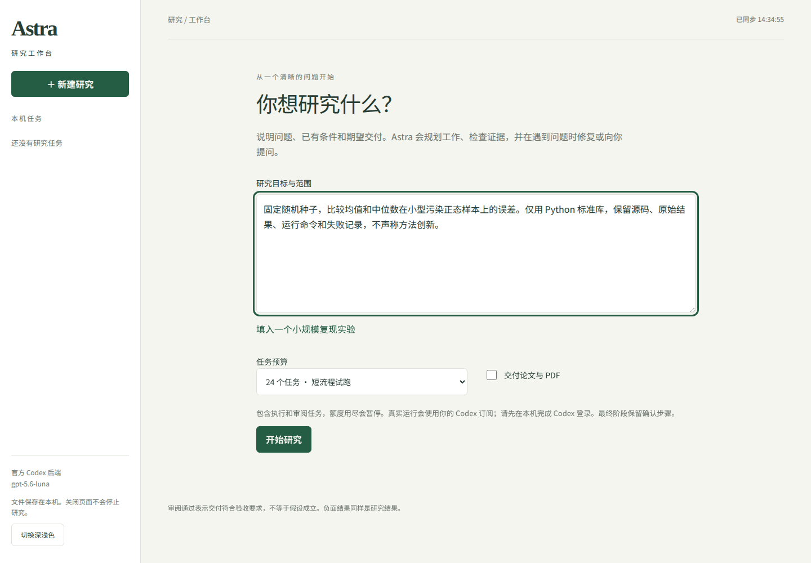
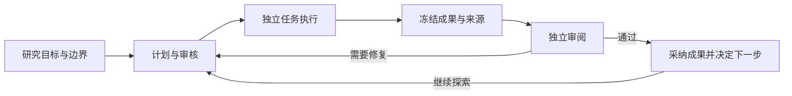

# Astra

面向个人研究者的开源自动研究框架，提供本机工作台。从一个有明确边界的问题开始，组织文献、实验和独立审阅，保留代码、数据、审阅意见与结论依据。

[项目主页](https://runder-sun.github.io/Astra/) · [快速开始](docs/getting-started.md) · [研究示例](docs/examples/README.md) · [下载实验版](https://github.com/Runder-sun/Astra/releases/tag/v0.1.0-alpha.2) · [English](README.en.md)

**当前下载版：`v0.1.0-alpha.2`（实验版）。** 本版集中改进任务调度、证据版本、审核与中断恢复。适合愿意检查原始材料的个人用户；真实研究尚未通过最终全流程验收，不保证任务收敛或论文达到发表要求。详细验证范围见[版本与支持](docs/support.md)。



*截图来自实际 alpha.1 安装包，仅展示填写研究目标，不代表已完成研究。*

## 可以怎样使用

- **限定研究问题**：说明目标、已有条件、预算和期望交付，先尝试小规模复现或比较实验。
- **观察执行与审阅**：查看任务、阶段验收项、审阅意见和未关闭问题；需要时暂停并补充说明。
- **检查成果依据**：下载已采纳材料，核验源码、原始数据与结论。流程完成和假设成立分别记录，负面结果同样保留。

## 安装并启动

先准备 Linux、Node.js 22.19 或更高版本、npm，以及已登录的官方 Codex CLI。其他系统尚未验证；模型账号和兼容版本说明见[环境要求](docs/getting-started.md#环境要求)。

在新的目录运行以下命令，安装固定版本的公开附件：

```bash
mkdir astra-test
cd astra-test
npm init -y
npm install --ignore-scripts https://github.com/Runder-sun/Astra/releases/download/v0.1.0-alpha.2/earendil-works-pi-astra-0.1.0-alpha.2.tgz
npx --no-install astra-workbench --root ./research --port 4319
```

在本机浏览器打开 `http://127.0.0.1:4319`，点击“新建研究”。首次选择 **24 个任务**，先不勾选论文交付。任务预算不是实际费用或订阅额度上限。

建议输入：“固定随机种子，比较均值和中位数在小型污染正态样本上的误差。仅用 Python 标准库，保留源码、原始结果和失败记录，不声称方法创新。”

完整步骤、暂停与恢复、备份及常见问题见[使用指南](docs/getting-started.md)。下载包沿用内部 Pi 包名，通过本仓库附件分发，不是上游 Pi 官方产品。

## 研究如何推进



研究按问题选择下一步，可以修订、回退或结束，不要求每个问题走固定流水线。执行者交付成果，审阅者核对材料，主研究代理决定是否采纳和继续；系统保留各次版本、失败与尚未关闭的问题。

你可以检查已采纳材料及其来源，也可以暂停、补充指导后继续。文献记录会区分搜索结果、摘要和已捕获原文；没有原文不能声称已核验全文。论文交付是可选项，仍需复现实验并人工检查稿件。

## alpha.2 改进了什么

| 问题 | 本版行为 |
| --- | --- |
| 小修订引用旧任务文件时完成或审核失败 | 保留旧文件的冻结版本，在审核、后续任务和下载时核对同一份材料 |
| 有剩余轮数，却因并行批次过大停止 | 按剩余额度缩小执行批次，保留预算确认与费用限制 |
| 中文、表情或错误日志在分片和截尾时损坏 | 请求与子进程独立解码，多个输出入口使用一致的安全截尾规则 |
| 成功会话缺失或审核对象错配仍被接受 | 按登记清单核验任务、成果目标和真实归档证明 |
| 中断后重复执行已经交付的任务 | 先核验持久交付再恢复；保留原审核、采纳与用户确认状态 |

本轮内核修复经独立审核，50 条验收标准通过，657 项指定离线测试通过。这些数字对应软件行为，不是自主科研成功率；打包和安装验证另见[alpha.2 发布记录](docs/releases/v0.1.0-alpha.2.md)。

## 从旧版本升级

先暂停研究并确认旧进程已停止，备份完整研究目录，然后在新目录安装 alpha.2。不要让两个版本同时写入同一个作业。旧预算确认不会自动降低；恢复前检查目标、已有材料和预算，具体操作见[暂停、继续和备份](docs/getting-started.md#暂停继续和备份)。

## 使用边界

- 工作台仅供个人本机访问，不提供公网多人服务。
- 研究可能执行模型生成的代码；请使用独立工作目录或隔离环境，按需授予权限。
- 关闭浏览器不会停止研究；服务重启后不会自动接管运行任务。
- 文献检索记录可能只有摘要或搜索片段，不能据此声称核验过全文。
- 论文需要额外编译工具，且必须人工检查可编辑源码、复现材料和 PDF 页面。

## 文档与参与

| 你想做什么 | 入口 |
| --- | --- |
| 安装、第一次运行、暂停和继续 | [快速开始](docs/getting-started.md) |
| 了解支持环境和已知限制 | [版本与支持](docs/support.md) |
| 查看示例与已有案例的证据边界 | [研究示例](docs/examples/README.md) |
| 修改源码或了解架构 | [开发指南](docs/development/README.md) |
| 构建和验证下一次发布 | [发布流程](docs/development/releases.md) |
| 报告问题或贡献修改 | [贡献指南](CONTRIBUTING.md) |
| 报告安全问题 | [安全说明](SECURITY.md) |

Astra 基于 Pi；当前运行所需的上游组件保留在仓库中。[来源与历史](docs/history/README.md)记录上游关系及旧 Rust 归档入口。遵循 [MIT 许可证](LICENSE)，保留上游版权声明。
